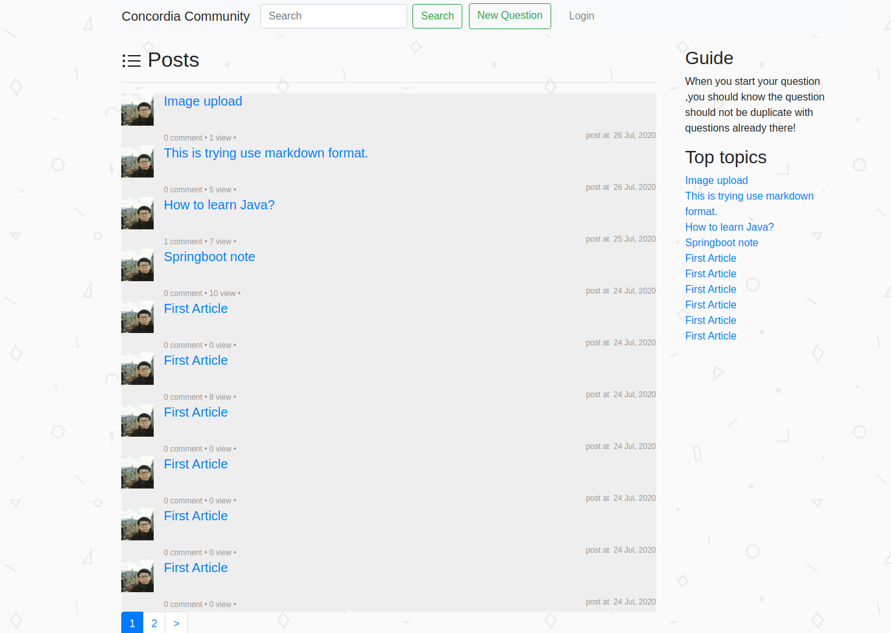
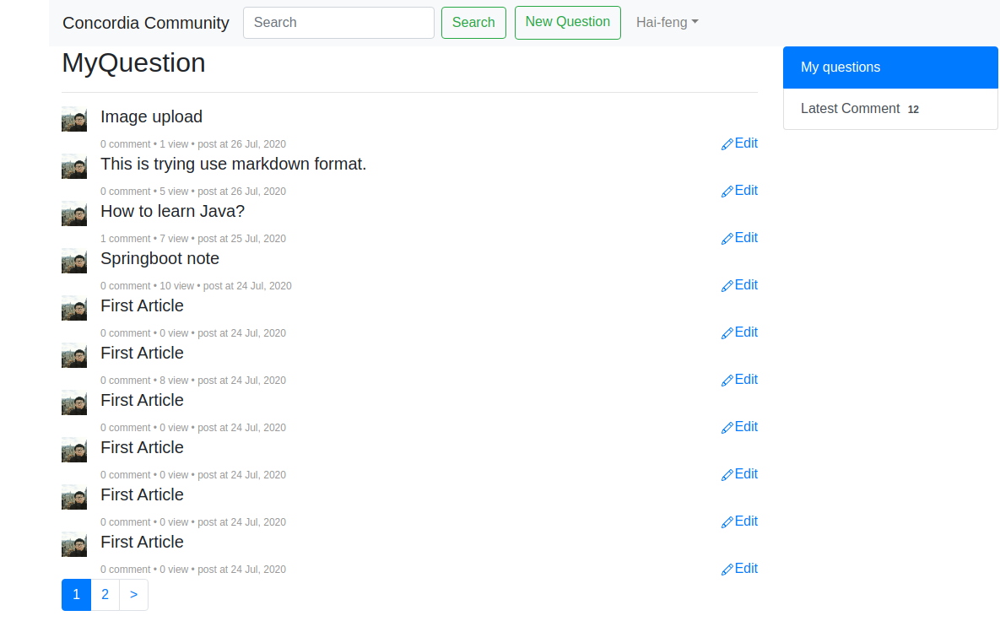

# Concordia Community
Community is a forum website for Concordia university, serve for students raising, discussing questions those are concerning.

Features:
- Github authentication login, avatar, user name
- Raise, reply questions
- Reply notification
- Markdown edit
- Top topic
- Related questions showing

Technology stack:
---
|  Technics   |  Link   |
| --- | --- |
|  Spring Boot   |  http://projects.spring.io/spring-boot/#quick-start   |
|   MyBatis  |  https://mybatis.org/mybatis-3/zh/index.html   |
|   MyBatis Generator  |  http://mybatis.org/generator/   |
|   H2  |   http://www.h2database.com/html/main.html  |
|Lombok| https://www.projectlombok.org |
|Bootstrap|https://v3.bootcss.com/getting-started/|
|Github OAuth|https://developer.github.com/apps/building-oauth-apps/creating-an-oauth-app/|
|Bootstrap|https://v3.bootcss.com/getting-started/|

**Screenshot(Don't mind the ugly UI):**

